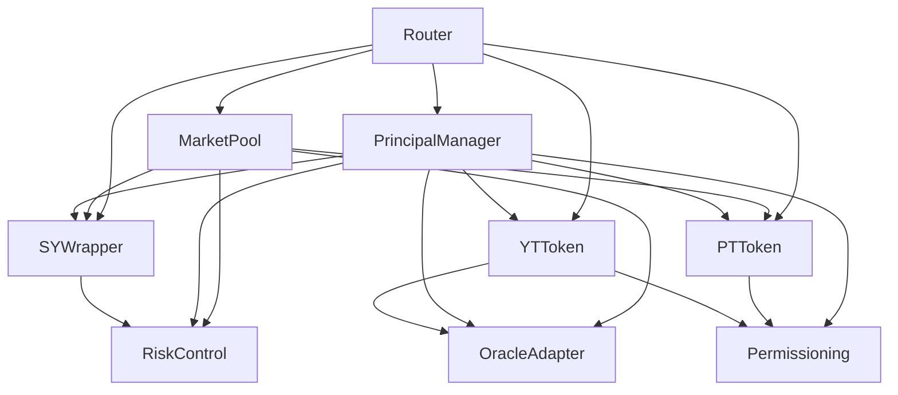
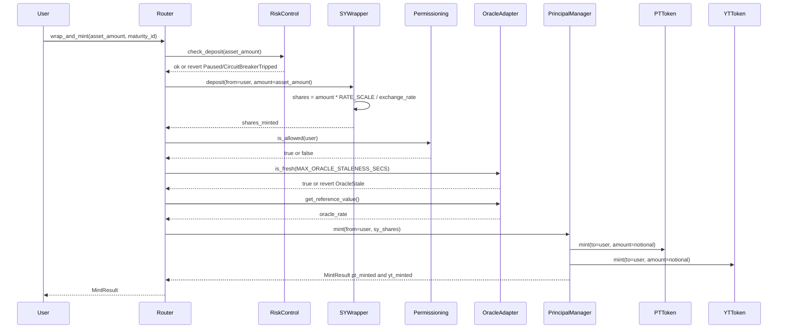
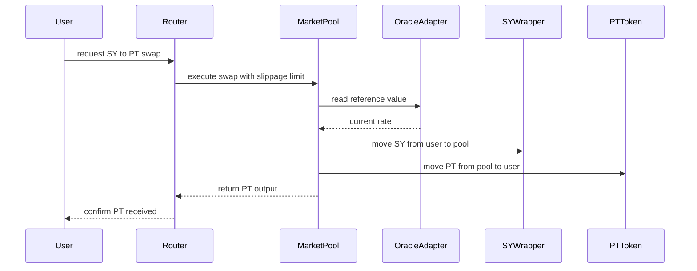
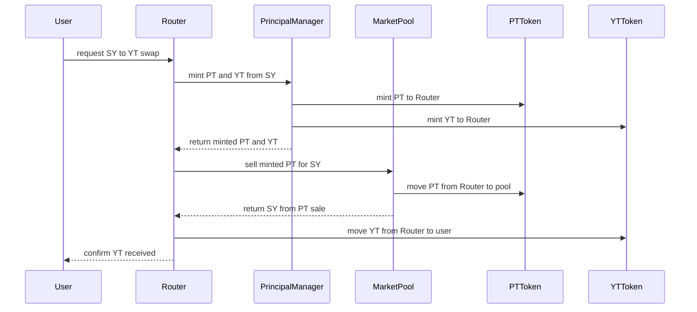
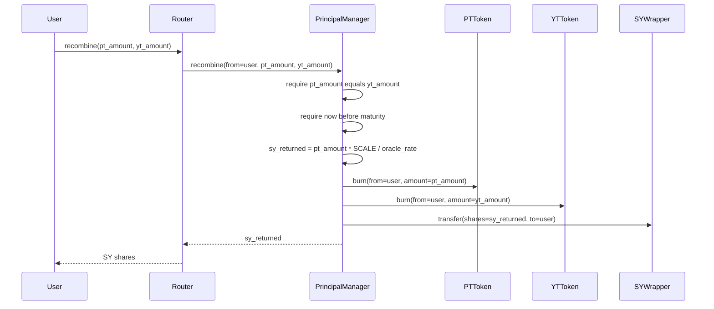
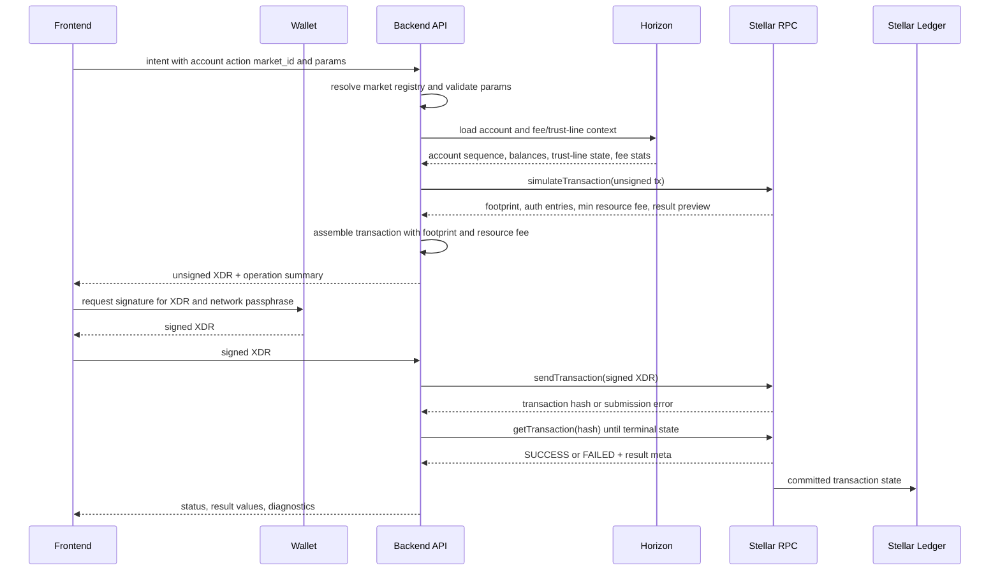
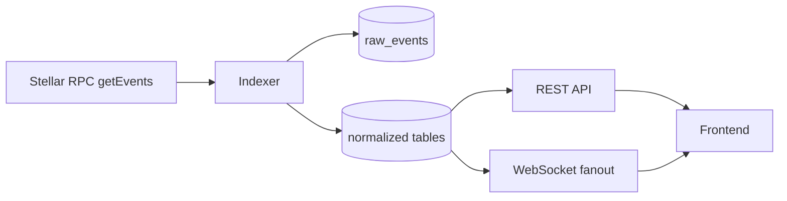
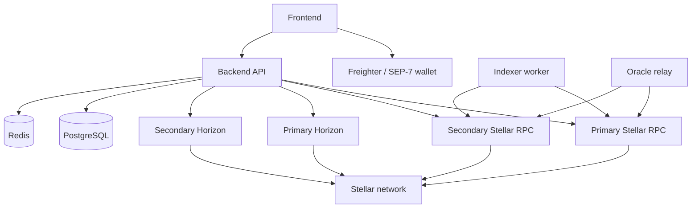

# Principal Protocol — Full-Stack Architecture

Version: 0.3 — Complete System Architecture  
Chain: Stellar / Soroban  
Stack: Soroban contracts · Stellar RPC · Horizon · Stellar SDK · Wallet signing · Backend API · Frontend client

---

## 1. System Layers

Principal Protocol is composed of five layers that work together from a user action in a browser down to on-chain settlement on Stellar. This document describes the full protocol architecture and the surrounding Stellar integration stack: accounts, assets, contract invocation, transaction simulation, wallet signing, event indexing, and deployment operations.

```
┌──────────────────────────────────────────────────────────────────────────┐
│  LAYER 5 — FRONTEND CLIENT                                              │
│  Any web or mobile client that supports Stellar wallet signing           │
└────────────────────────────────┬─────────────────────────────────────────┘
                                 │ HTTPS / WebSocket
┌────────────────────────────────▼─────────────────────────────────────────┐
│  LAYER 4 — BACKEND API                                                  │
│  Tx builder · Oracle relay · Indexer · Market data cache · Registry      │
└────────────────────────────────┬─────────────────────────────────────────┘
                                 │ Stellar RPC / Horizon REST / Wallet APIs
┌────────────────────────────────▼─────────────────────────────────────────┐
│  LAYER 3 — STELLAR NETWORK INTERFACE                                    │
│  Stellar RPC · Horizon API · XDR · SACs · Wallet signing · Event ingest  │
└────────────────────────────────┬─────────────────────────────────────────┘
                                 │
┌────────────────────────────────▼─────────────────────────────────────────┐
│  LAYER 2 — SOROBAN SMART CONTRACTS                                      │
│  Router · MarketPool · PrincipalManager · SYWrapper · PTToken · YTToken  │
│  OracleAdapter · Permissioning · RiskControl                             │
└────────────────────────────────┬─────────────────────────────────────────┘
                                 │
┌────────────────────────────────▼─────────────────────────────────────────┐
│  LAYER 1 — STELLAR LEDGER                                               │
│  Consensus · Stellar Asset Contracts · Account ledger entries            │
└──────────────────────────────────────────────────────────────────────────┘
```

The protocol is **asset-agnostic**. Any Stellar yield-bearing asset represented as a SEP-41 / Stellar Asset Contract can be wrapped and tokenized. USDY (Ondo) is the first supported market and is used throughout this document as a reference example.

---

## 2. Smart Contract Layer

### 2.1 Contract inventory

| Contract | Deployment scope | Role |
|---|---|---|
| `OracleAdapter` | One per underlying asset | Reference value feed for the underlying asset, with monotonic timestamps and freshness controls |
| `Permissioning` | One per underlying asset or issuer policy | Account and per-asset eligibility registry for permissioned RWAs |
| `RiskControl` | One per underlying asset or protocol risk domain | Global pause, pauser roles, and rolling deposit circuit breaker |
| `SYWrapper` | One per underlying asset | Standardized yield wrapper; accepts a SAC-compatible yield-bearing asset and issues SY shares |
| `PrincipalManager` | One per underlying asset and maturity | Splits SY shares into PT/YT notional claims and handles maturity settlement |
| `PTToken` | One per maturity | SEP-41 Principal Token representing the fixed principal claim |
| `YTToken` | One per maturity | SEP-41 Yield Token representing the future yield claim and claimable yield index |
| `MarketPool` | One per maturity | Yield-curve AMM for PT ↔ SY trading |
| `Router` | Shared across registered markets | Single-transaction orchestration for wrapping, minting, swapping, recombining, redeeming, and liquidity operations |

### 2.2 Contract dependency graph



### 2.3 Asset-agnostic design

Each set of per-maturity contracts (`PrincipalManager`, `PTToken`, `YTToken`, `MarketPool`) is instantiated independently for each combination of underlying asset and maturity date. Infrastructure contracts (`OracleAdapter`, `Permissioning`, `RiskControl`, `SYWrapper`) are shared across all markets for a given underlying. The `Router` is a single shared contract that maintains a registry mapping each `maturity_id` (the `PrincipalManager` address) to its full associated contract set.

```
        Shared infrastructure (one set per underlying asset)
        ┌──────────────────────────────────────────────┐
        │  OracleAdapter (asset reference value)        │
        │  Permissioning (eligibility — optional)       │
        │  RiskControl   (pause + circuit breaker)      │
        │  SYWrapper     (yield wrapper for this asset) │
        └──────────────────────────────────────────────┘
                              │
          ┌───────────────────┼───────────────────┐
          ▼                   ▼                   ▼
    Maturity: 3M        Maturity: 6M        Maturity: 12M
    PrincipalManager    PrincipalManager    PrincipalManager
    PTToken  ─set_minter▶ PM   PTToken         PTToken
    YTToken  ─set_minter▶ PM   YTToken         YTToken
    MarketPool          MarketPool          MarketPool

    Router (shared — registered for all maturities via register_market)
```

**Two-phase token initialization:** `PTToken` and `YTToken` are deployed before `PrincipalManager` (so their addresses can be passed to it at init), then `set_minter(principal_manager_address)` is called on each after `PrincipalManager` is deployed. This breaks the circular dependency. Until `set_minter` is called, `mint` and `burn` revert with `Unauthorized`.

A new asset is onboarded by deploying a fresh infrastructure set and per-maturity contracts, then registering them in the Router. No changes to existing deployed contracts are required.

### 2.4 Core on-chain sequences

#### Deposit and mint



#### AMM swap: SY → PT



#### Flash-mint YT (buy YT in one transaction)



#### Maturity redemption


#### Pre-maturity recombination



---

## 3. Stellar Network Interface Layer

The Stellar network interface is the protocol boundary between application services and ledger state. The application does not maintain a private ledger mirror. It uses Stellar RPC for Soroban contract execution and contract data, Horizon for classic account and asset information, and wallet APIs for user authorization.

### 3.1 Integration stack map

| Stack component | Primary responsibility | Principal Protocol usage |
|---|---|---|
| **Stellar ledger** | Consensus, ledger close, account sequence numbers, fees, trust lines, contract state | Final source of truth for balances, contract storage, events, and transaction results |
| **Stellar Asset Contracts (SACs)** | Soroban contract representation of Stellar assets | Underlying assets such as USDY are transferred through the SAC token interface into `SYWrapper` |
| **Soroban contracts** | Protocol execution and storage | `Router`, `MarketPool`, `PrincipalManager`, `SYWrapper`, `PTToken`, `YTToken`, `OracleAdapter`, `Permissioning`, `RiskControl` |
| **Stellar RPC** | Soroban simulation, transaction submission, contract state reads, event queries | Build footprints, compute resource fees, submit signed XDR, poll transaction status, index contract events |
| **Horizon API** | Classic Stellar account, payment, trust-line, fee, and transaction data | Read user's XLM balance, underlying asset trust lines, issuer/account metadata, fee stats, and historical account activity |
| **Stellar SDK** | XDR construction and decoding | Build `InvokeHostFunction` operations, encode/decode `ScVal`, assemble simulated transactions, parse result meta |
| **Wallet APIs** | User signing and account discovery | Freighter and SEP-7-compatible wallets sign the XDR envelope; backend never handles user private keys |
| **Stellar CLI** | Operator deployment and administration | Deploy WASM, initialize contracts, rotate admins, update oracle/risk parameters, inspect contract state |
| **Backend registry** | Off-chain address and market mapping | Resolves `{asset, maturity}` to SAC address, protocol contract IDs, network passphrase, decimals, and issuer metadata |

### 3.2 Stellar data boundaries

| Data or action | Use Stellar RPC | Use Horizon | Reason |
|---|---:|---:|---|
| Simulate a contract invocation | Yes | No | Only Stellar RPC can compute Soroban footprints, auth entries, and resource fees |
| Submit a Soroban transaction | Yes | No | Contract invocations are submitted through Stellar RPC |
| Poll a contract transaction result | Yes | Optional | RPC returns Soroban-specific status, return values, and diagnostic data |
| Read contract storage | Yes | No | Contract instance and persistent data are exposed through RPC ledger entries |
| Read contract events | Yes | No | Protocol indexer consumes Soroban contract events through RPC |
| Read classic account balances | Optional | Yes | Horizon gives account balances, XLM reserve state, and asset trust lines in a convenient account view |
| Check underlying trust line | Optional | Yes | Horizon exposes classic asset trust-line existence, balance, limits, authorization flags, and issuer |
| Query fee stats | Optional | Yes | Horizon fee stats are useful for fee policy and UX estimates |
| Explore account transaction history | Optional | Yes | Horizon is optimized for account/payment/history views |

### 3.3 Account, address, and asset model

| Entity | Stellar representation | Protocol usage |
|---|---|---|
| User account | `G...` public key account | Source account for user transactions; signer in Freighter or SEP-7 wallet |
| Contract account | `C...` contract ID | Address for each deployed protocol contract and SAC |
| Underlying RWA asset | Classic Stellar asset plus SAC contract address | User holds the asset through a trust line; `SYWrapper` receives it through the SAC token interface |
| PT/YT/LP instruments | SEP-41 Soroban token contracts | User receives token balances that can be displayed by the frontend and routed through protocol contracts |
| Market ID | Off-chain registry key such as `usdy:2026-09-30` | Backend resolves market actions to contract IDs and maturity metadata |
| Network | Public, Testnet, Futurenet, or private network | Determines network passphrase, RPC URL, Horizon URL, and wallet signing context |

SAC integration has two sides. Horizon is used to display the user's classic asset balance and trust-line state. Soroban contracts interact with the same asset through the SAC contract address and token calls such as `transfer`, `balance`, `decimals`, `symbol`, and `name`.

### 3.4 Full Stellar transaction lifecycle

Every user-facing operation follows this lifecycle:



The backend never holds user private keys. It builds and submits XDR; the user's wallet signs. Admin-only automation, such as oracle updates, uses a separate signer controlled by an HSM, secrets manager, or multisig operator flow.

### 3.5 Transaction assembly details

1. The backend loads the source account and current sequence number from Horizon or an SDK account-loading helper.
2. It creates an `InvokeHostFunction` operation for the target contract call.
3. It simulates the transaction through Stellar RPC.
4. The simulation response provides the Soroban resource footprint, auth entries, and minimum resource fee.
5. The backend assembles the transaction using the simulation result.
6. The frontend asks the wallet to sign the assembled XDR with the correct network passphrase.
7. The backend submits the signed XDR and polls until final status.
8. The backend parses `ScVal` return values and diagnostic events into JSON for the frontend.

Important implementation rules:

- A transaction must be simulated before signing so the footprint and Soroban resource fee are included.
- The final signed XDR must use the same network passphrase shown to the wallet.
- Contract calls requiring `require_auth()` must include the auth entries produced by simulation.
- The source account must maintain enough XLM for fees and minimum balance reserves.
- The backend must treat simulation output as advisory. The transaction can still fail if ledger state changes before submission.

### 3.6 Stellar RPC methods

| Method | Used for |
|---|---|
| `getLatestLedger` | Read the latest ledger sequence and close timestamp |
| `getNetwork` | Confirm network passphrase and RPC network identity |
| `simulateTransaction` | Validate operation, compute footprint, resource limits, auth entries, and resource fee |
| `sendTransaction` | Submit a signed transaction envelope |
| `getTransaction` | Poll transaction status and extract return value XDR, events, and diagnostics |
| `getLedgerEntries` | Read specific contract instance or persistent storage keys |
| `getEvents` | Fetch contract events over a ledger range for indexing and WebSocket updates |
| `getFeeStats` | Read fee statistics when supported by the RPC provider |

### 3.7 Horizon endpoints

| Endpoint | Used for |
|---|---|
| `GET /accounts/{address}` | User XLM balance, underlying asset trust lines, sequence, sponsorship, and reserve context |
| `GET /accounts/{address}/transactions` | Account transaction history for portfolio activity pages |
| `GET /assets` | Asset issuer and asset-code discovery for supported underlying assets |
| `GET /fee_stats` | Fee estimates and surge pricing context |
| `GET /ledgers/{sequence}` or `GET /ledgers?order=desc&limit=1` | Ledger close timestamps for historical views |
| `GET /transactions/{hash}` | Human-friendly transaction status/history fallback |

### 3.8 Contract event ingestion

The backend polls `getEvents` every ledger close and dispatches by contract ID and event topic. The indexer stores raw XDR and decoded normalized rows. Raw records allow reprocessing if event schemas change; normalized rows power market APIs and charts.



| Contract | Event symbol | Backend action |
|---|---|---|
| OracleAdapter | `ref_set` | Update cached rate; recompute implied APY; push WebSocket update |
| Permissioning | `acc_grant`, `acc_rev`, `ast_grant`, `ast_rev` | Refresh eligibility cache for affected account and asset |
| SYWrapper | `deposit` | Update TVL and SY supply; push market update |
| SYWrapper | `withdraw` | Update TVL and SY supply |
| PrincipalManager | `mint` | Update outstanding PT/YT supply and user position index |
| PrincipalManager | `redeem` | Update settlement log and reduce supply |
| PrincipalManager | `recombine` | Update supply and user position index |
| PTToken / YTToken | `transfer`, `mint`, `burn` | Update holder balances and transfer history |
| MarketPool | `swap` | Update pool reserves; recompute implied rate; append rate history |
| MarketPool | `add_liq` | Update pool depth and LP positions |
| MarketPool | `rem_liq` | Update pool depth and LP positions |
| RiskControl | `paused`, `unpaused` | Broadcast protocol state and disable/enable affected actions |
| RiskControl | `cb_tripped` | Broadcast circuit-breaker warning; disable deposit endpoints |

### 3.9 Stellar failure modes and retries

| Failure | Detection | Handling |
|---|---|---|
| Simulation failure | `simulateTransaction` returns error or diagnostic events | Return a structured error before wallet signing |
| Sequence number race | Submission fails because source sequence has changed | Reload account and rebuild XDR; require a fresh wallet signature |
| Expired transaction | Transaction timeout reached before inclusion | Rebuild with new sequence and timeout; require a fresh signature |
| Insufficient fee or resource fee | Simulation or submission error | Re-simulate and adjust fee policy within user-approved limits |
| RPC provider lag | Latest ledger does not advance or transaction status remains unknown | Retry against secondary RPC provider and preserve idempotency by transaction hash |
| Horizon lag | Account view behind RPC ledger | Prefer RPC for contract finality; mark Horizon-derived balances as eventually consistent |
| Missing trust line | Horizon account balance lacks underlying asset | Block wrap/deposit actions and show asset trust-line setup flow through `changeTrust` or the SAC `trust` helper when available |
| Unauthorized permissioned asset | Horizon trust-line authorization or `Permissioning` denies account | Block protocol action and direct user to issuer onboarding |
| Archived contract data | Simulation identifies archived persistent entries | Build and submit a restore transaction before retrying the user operation |

### 3.10 Provider topology and network configuration

Production deployments should treat Stellar RPC and Horizon as provider-backed dependencies with health checks and failover. The backend keeps a primary and secondary RPC endpoint, a primary and secondary Horizon endpoint, and a network configuration record for every supported environment.



| Configuration key | Purpose |
|---|---|
| `STELLAR_NETWORK` | Environment name used by the backend and frontend, e.g. `public`, `testnet`, or private network name |
| `NETWORK_PASSPHRASE` | Exact passphrase included in every transaction and wallet signing request |
| `STELLAR_RPC_PRIMARY_URL` | Primary RPC endpoint for simulation, submission, state reads, and events |
| `STELLAR_RPC_SECONDARY_URL` | Failover RPC endpoint used when primary is stale or unavailable |
| `HORIZON_PRIMARY_URL` | Primary Horizon endpoint for account, trust-line, fee, and history reads |
| `HORIZON_SECONDARY_URL` | Failover Horizon endpoint |
| `CONTRACT_REGISTRY_PATH` | Registry of asset IDs, SAC addresses, protocol contract IDs, maturities, decimals, and issuers |
| `ORACLE_CONFIG_PATH` | Per-asset oracle source, relay interval, signer reference, deviation threshold, and staleness threshold |
| `INDEXER_START_LEDGER` | Ledger checkpoint used when bootstrapping or replaying the event indexer |

Health checks compare each provider's latest ledger sequence and close time. The backend marks a provider unhealthy when it lags the selected network by more than the configured ledger threshold, returns inconsistent network passphrases, or repeatedly fails simulation/submission calls.

### 3.11 Underlying asset deposit path

The deposit path combines classic Stellar asset state with Soroban contract execution:

1. Backend verifies the user account exists and has enough XLM reserve for fees.
2. Backend reads Horizon balances to confirm the underlying asset trust line exists. If missing, the UI offers a trust-line setup transaction before deposit.
3. Backend checks issuer authorization flags for permissioned assets when exposed by Horizon.
4. Backend checks protocol eligibility through `Permissioning` or the indexed eligibility cache.
5. Backend builds a `Router.wrap_and_mint` transaction that calls `SYWrapper.deposit`.
6. `SYWrapper` transfers the underlying asset through the SAC token interface from the user to the wrapper contract.
7. `SYWrapper` mints SY shares; `PrincipalManager` splits SY into PT and YT.
8. Events emitted by the contracts update the backend index and frontend portfolio view.

---

## 4. Backend API Layer

### 4.1 Overview

The backend is an API service that handles all interactions with the Stellar network on behalf of the frontend. It holds no user funds and no user private keys. It comprises two distinct parts: a **stateless REST/WebSocket server** (transaction building, market data) and a **stateful oracle relay** (a scheduled job that holds and uses an admin signing key for oracle updates only). Its responsibilities are:

- **Transaction building** — construct unsigned Soroban XDR so the frontend only needs to sign.
- **State caching** — cache contract state (oracle rate, pool reserves) to reduce direct RPC calls.
- **Event indexing** — persist on-chain events into a queryable database.
- **Market data** — compute and serve implied APY, pool depth, and rate history.
- **Oracle relay** — submit signed oracle updates on a schedule (admin-only operation).
- **Eligibility relay** — fetch permissioning state for connected accounts.

The API is designed to be **asset-agnostic**. Market routes accept a `market_id` parameter that identifies the target underlying asset and maturity. The same endpoints serve USDY, BENJI, USTBL, or any other asset that has been registered in the protocol.

### 4.2 Service architecture

```
┌────────────────────────────────────────────────────────────────────┐
│  Backend API                                                       │
│                                                                    │
│  ┌─────────────────┐  ┌──────────────────┐  ┌──────────────────┐ │
│  │  REST API        │  │  WebSocket server │  │  Oracle relay    │ │
│  │  /api/v1/*       │  │  /ws              │  │  (cron job)      │ │
│  └────────┬────────┘  └────────┬─────────┘  └────────┬─────────┘ │
│           │                    │                      │            │
│  ┌────────▼────────────────────▼──────────────────────▼─────────┐ │
│  │                       Service Layer                           │ │
│  │  MarketService · OracleService · PortfolioService             │ │
│  │  TransactionBuilder · Indexer · PermissioningService          │ │
│  └────────┬──────────────────────────────────────────────────────┘ │
│           │                                                         │
│  ┌────────▼──────────────────────────────────────────────────────┐ │
│  │                       Data Layer                               │ │
│  │  Cache (Redis) · Event store (PostgreSQL) · In-memory state   │ │
│  └────────┬──────────────────────────────────────────────────────┘ │
└───────────┼────────────────────────────────────────────────────────┘
            │
     Stellar RPC  /  Horizon API
```

### 4.3 REST API routes

All routes that reference a specific market accept `market_id` in the format `{asset}:{maturity}` (e.g. `usdy:3m`, `benji:6m`). The backend resolves this to the correct set of contract addresses from a registry.

#### Markets

```
GET  /api/v1/markets
     → list all active markets across all assets and maturities

GET  /api/v1/markets/:market_id
     → pool state, oracle rate, implied APY, PT price, YT yield, TVL

GET  /api/v1/markets/:market_id/rates/history?from=&to=
     → time series of implied APY (from indexed swap events)

GET  /api/v1/markets/:market_id/depth
     → simulated order book depth from AMM curve at current state
```

#### Oracle

```
GET  /api/v1/oracle/:asset/rate
     → current reference value and freshness status for a given asset

GET  /api/v1/oracle/:asset/history?from=&to=
     → historical reference values from indexed oracle events
```

#### Transaction builder

All transaction endpoints return unsigned XDR. The client signs and returns it to `/tx/submit`.

```
POST /api/v1/tx/wrap-and-mint
     { account, asset, amount, market_id }
     → unsigned XDR: deposit(SYWrapper) + mint(PrincipalManager)

POST /api/v1/tx/swap-sy-for-pt
     { account, sy_amount, min_pt_out, market_id }
     → unsigned XDR: Router.swap_sy_for_pt(...)

POST /api/v1/tx/swap-pt-for-sy
     { account, pt_amount, min_sy_out, market_id }

POST /api/v1/tx/swap-sy-for-yt
     { account, sy_amount, min_yt_out, market_id }
     → unsigned XDR: Router flash-mint pattern

POST /api/v1/tx/swap-yt-for-sy
     { account, yt_amount, min_sy_out, market_id }
     → unsigned XDR: Router flash-redeem pattern

POST /api/v1/tx/add-liquidity
     { account, pt_amount, sy_amount, min_lp_out, market_id }

POST /api/v1/tx/remove-liquidity
     { account, lp_amount, market_id }

POST /api/v1/tx/redeem
     { account, pt_amount, yt_amount, market_id }

POST /api/v1/tx/recombine
     { account, pt_amount, yt_amount, market_id }

POST /api/v1/tx/submit
     { signed_xdr }
     → { tx_hash, status }

GET  /api/v1/tx/:hash/status
     → { status: "pending"|"success"|"failed", result?, error? }
```

#### Portfolio

```
GET  /api/v1/portfolio/:account
     → balances across all assets and maturities:
        { asset_balances[], sy_balances[], pt_holdings[], yt_holdings[], lp_holdings[] }

GET  /api/v1/portfolio/:account/eligibility
     → { assets: [{ asset_id, is_allowed }] }

GET  /api/v1/portfolio/:account/history
     → paginated on-chain activity for this account
```

### 4.4 WebSocket push events

The backend pushes real-time updates to subscribed frontend clients:

```json
{ "type": "rate_update",    "asset": "usdy",
  "data": { "oracle_rate": 10312000, "implied_apy_bps": 421, "timestamp": 1748000000 } }

{ "type": "pool_update",    "market_id": "usdy:3m",
  "data": { "total_pt": "...", "total_sy": "...", "implied_rate": "..." } }

{ "type": "protocol_paused",
  "data": { "asset": "usdy", "caller": "G..." } }

{ "type": "circuit_breaker",
  "data": { "asset": "usdy", "volume": "...", "limit": "...", "window_reset_at": "..." } }

{ "type": "tx_confirmed",
  "data": { "hash": "...", "account": "G...", "action": "mint", "result": { ... } } }
```

Clients subscribe by account and/or market_id. The backend manages subscriptions and fans out relevant events.

### 4.5 Oracle relay service

The oracle relay is a scheduled backend job that bridges an off-chain reference value feed to the `OracleAdapter` contract. It is **asset-specific**: each supported underlying asset has its own relay configuration pointing to its data source (e.g. an issuer API, a price aggregator, or an institutional feed).

```
Oracle relay loop (configurable interval, e.g. every 10 minutes):
  1. Fetch reference value from configured feed URL for this asset
  2. Validate: timestamp is newer than last on-chain timestamp
  3. Validate: rate deviation from on-chain rate ≤ MAX_DEVIATION_BPS
  4. Build OracleAdapter.set_reference_value transaction (XDR)
  5. Sign with oracle admin key (HSM or secrets manager — never in application memory)
  6. Submit via Stellar RPC sendTransaction
  7. Confirm via getTransaction polling
  8. Log result; trigger alert on failure
```

The relay can operate in a single-source or multi-source mode depending on the asset's risk policy. A single-source asset uses one trusted issuer or institutional feed and submits directly to `OracleAdapter.set_reference_value`. A multi-source asset uses independent relayers that submit candidate values to an aggregation adapter; the adapter writes the canonical median or quorum-approved value. In both modes, the relay freshness configuration must match the on-chain staleness threshold used by `PrincipalManager` and `MarketPool`.

**Configuration per asset:**

```yaml
assets:
  - id: usdy
    oracle_contract: C...
    feed_url: https://...          # issuer or institutional feed
    admin_key_ref: hsm://...       # key reference, never plaintext
    relay_interval_secs: 600
    max_deviation_bps: 100         # 1% max per update
    max_staleness_secs: 3600

  - id: benji
    oracle_contract: C...
    feed_url: https://...
    admin_key_ref: hsm://...
    relay_interval_secs: 600
    max_deviation_bps: 100
    max_staleness_secs: 3600
```

### 4.6 Indexer service

The indexer polls `getEvents` from Stellar RPC at each new ledger and writes structured records to PostgreSQL for queryable history and analytics.

```
Indexer loop (~every 5s):
  1. getLatestLedger → current_ledger
  2. getEvents(from=last_indexed_ledger, to=current_ledger,
               contract_ids=[all protocol contracts])
  3. For each event:
     - parse topic + data XDR via Stellar SDK
     - insert into events table
     - update materialized views (TVL, daily volume, implied APY series)
  4. Update last_indexed_ledger checkpoint
```

**PostgreSQL schema (core tables):**

```sql
CREATE TABLE events (
  id            BIGSERIAL PRIMARY KEY,
  ledger        INTEGER NOT NULL,
  tx_hash       TEXT NOT NULL,
  contract_id   TEXT NOT NULL,
  event_type    TEXT NOT NULL,
  asset_id      TEXT,
  market_id     TEXT,
  account       TEXT,
  amount_in     NUMERIC,
  amount_out    NUMERIC,
  oracle_rate   NUMERIC,
  implied_rate  NUMERIC,
  timestamp     TIMESTAMPTZ NOT NULL,
  raw_data      JSONB
);

CREATE TABLE market_snapshots (
  id            BIGSERIAL PRIMARY KEY,
  market_id     TEXT NOT NULL,
  ledger        INTEGER NOT NULL,
  total_pt      NUMERIC,
  total_sy      NUMERIC,
  implied_rate  NUMERIC,
  tvl_underlying NUMERIC,
  timestamp     TIMESTAMPTZ NOT NULL
);

CREATE TABLE oracle_history (
  id            BIGSERIAL PRIMARY KEY,
  asset_id      TEXT NOT NULL,
  reference_value NUMERIC NOT NULL,
  ledger        INTEGER NOT NULL,
  timestamp     TIMESTAMPTZ NOT NULL
);
```

---

## 5. Frontend Integration Layer

### 5.1 Responsibilities

The frontend is a web client that:

- Connects to a Stellar-compatible browser wallet.
- Requests unsigned transaction XDR from the backend.
- Presents the operation summary to the user and triggers wallet signing.
- Submits the signed XDR back to the backend and polls for confirmation.
- Displays market data, user portfolio, and protocol state received from the backend API and WebSocket.

The frontend is **not tied to any specific asset or market**. All asset references, contract addresses, and market parameters are provided by the backend API. Adding a new underlying asset requires no frontend code changes — the backend registry drives what markets are displayed.

### 5.2 Recommended tech stack

| Concern | Recommended choice |
|---|---|
| Framework | Next.js (App Router) or any React-based framework |
| Language | TypeScript |
| Stellar SDK | `@stellar/stellar-sdk` |
| Wallet integration | `@stellar/freighter-api` (primary); SEP-7 for deep-link wallets |
| State management | Any (Zustand, Redux, React Query) |
| Real-time data | Native WebSocket client |

### 5.3 Wallet integration

The frontend integrates with Freighter and any SEP-7-compatible Stellar wallet. The integration pattern is the same regardless of underlying asset.

```typescript
import { getPublicKey, signTransaction, isConnected } from '@stellar/freighter-api';

// Connect wallet
const connected  = await isConnected();
const publicKey  = await getPublicKey();   // G... Stellar address

// Build transaction via backend
const { xdr } = await api.post('/tx/wrap-and-mint', {
  account:   publicKey,
  asset:     'usdy',               // or any supported asset
  amount:    '100_0000000',        // in stroops / token decimals
  market_id: 'usdy:3m',
});

// Sign in wallet with the same network passphrase used by the transaction builder.
const signedXDR = await signTransaction(xdr, {
  networkPassphrase: NETWORK_PASSPHRASE,
  accountToSign: publicKey,
});

// Submit via backend
const { tx_hash } = await api.post('/tx/submit', { signed_xdr: signedXDR });
```

**Auth entry handling:** Soroban contract calls that require `require_auth()` produce auth entries during the simulation step. These are embedded into the XDR envelope by the backend before returning it to the frontend. Freighter displays a human-readable summary of the contract call (contract ID, function name, arguments) before the user approves.

### 5.4 Transaction state machine

```
idle
 │ user triggers action
 ▼
building          POST /api/v1/tx/:action → unsigned XDR
 │
 ▼
awaiting_signature   wallet.signTransaction(xdr)
 │
 ▼
submitting        POST /api/v1/tx/submit → tx_hash
 │
 ▼
confirming        GET /api/v1/tx/:hash/status  (poll or WebSocket)
 │
 ├─ success ──►   confirmed   display result; refresh portfolio balances
 └─ failed  ──►   error       display error message; allow retry
```

### 5.5 Eligibility handling

For permissioned assets, the frontend fetches eligibility before presenting protocol actions:

```typescript
const { assets } = await api.get(`/portfolio/${publicKey}/eligibility`);
const eligible = assets.find(a => a.asset_id === 'usdy')?.is_allowed;

if (!eligible) {
  // show compliance gate specific to the asset's onboarding flow
  // e.g. redirect to the underlying asset issuer's KYC portal
}
```

Eligibility state is polled after each block while the user is on a permissioned market page. When eligibility is granted on-chain, the gate lifts automatically.

---

## 6. Stellar SDK Integration Reference

### 6.1 Building a Soroban contract call (Node.js / TypeScript)

```typescript
import {
  Contract, Horizon, SorobanRpc, TransactionBuilder,
  Networks, BASE_FEE, nativeToScVal, Address,
} from '@stellar/stellar-sdk';

const rpc     = new SorobanRpc.Server(SOROBAN_RPC_URL);
const horizon = new Horizon.Server(HORIZON_URL);
const contract = new Contract(ROUTER_CONTRACT_ID);

// Build operation
const op = contract.call(
  'swap_sy_for_pt',
  Address.fromString(userAddress).toScVal(),
  nativeToScVal(syAmount,  { type: 'i128' }),
  nativeToScVal(minPtOut,  { type: 'i128' }),
);

// Load account sequence number
const account = await horizon.loadAccount(userAddress);

// Assemble transaction
const tx = new TransactionBuilder(account, {
  fee: BASE_FEE,
  networkPassphrase: Networks.PUBLIC,    // Stellar mainnet. Use Networks.TESTNET for testnet.
})
  .addOperation(op)
  .setTimeout(30)
  .build();

// Simulate: get footprint, auth entries, resource fee
const sim = await rpc.simulateTransaction(tx);
if (SorobanRpc.Api.isSimulationError(sim)) throw new Error(sim.error);

// Assemble with footprint and resource fee
const assembled = SorobanRpc.assembleTransaction(tx, sim).build();

// Return XDR to frontend for wallet signing
return assembled.toXDR();
```

### 6.2 Reading contract state directly (getLedgerEntries)

```typescript
import { xdr, Address, Contract } from '@stellar/stellar-sdk';

// Build a storage key for a specific contract data entry
const contractDataKey = xdr.LedgerKey.contractData(
  new xdr.LedgerKeyContractData({
    contract:    new Address(ORACLE_ADAPTER_CONTRACT_ID).toScAddress(),
    key:         xdr.ScVal.scvLedgerKeyContractInstance(),
    durability:  xdr.ContractDataDurability.persistent(),
  })
);

const { entries } = await rpc.getLedgerEntries(contractDataKey);
// entries[0].val contains the contract instance storage as XDR
// parse with xdr.ScVal.fromXDR(...) to extract Price, Timestamp, etc.
```

### 6.3 Polling contract events (indexer)

```typescript
const events = await rpc.getEvents({
  startLedger: lastProcessedLedger,
  filters: [
    {
      type: 'contract',
      contractIds: ALL_PROTOCOL_CONTRACT_IDS,   // all assets, all maturities
    },
  ],
  limit: 200,
});

for (const event of events.events) {
  const topicVals = event.topic.map(t => scValToNative(xdr.ScVal.fromXDR(t, 'base64')));
  const eventType = topicVals[0];               // e.g. 'mint', 'swap', 'ref_set'
  const data      = scValToNative(xdr.ScVal.fromXDR(event.value.xdr, 'base64'));
  // dispatch to indexer handler by eventType
}
```

### 6.4 Fetching underlying asset balances (Horizon)

```typescript
import { Horizon } from '@stellar/stellar-sdk';

const horizon = new Horizon.Server(HORIZON_URL);
const account = await horizon.loadAccount(userAddress);

// The underlying asset is a Stellar Asset Contract (SAC)
// Its balance appears as a trust line on the account
const assetBalance = account.balances.find(
  b => b.asset_type !== 'native'
    && b.asset_code   === ASSET_CODE          // e.g. 'USDY'
    && b.asset_issuer === ASSET_ISSUER        // issuer's G... address
);
```

---

## 7. Oracle Architecture

### 7.1 Full data flow

```
External reference value feed (issuer API or price aggregator)
        │
        ▼  (HTTPS, configurable interval)
Oracle Relay (backend scheduled job — one per asset)
  - validate rate delta vs on-chain value
  - sign transaction (HSM / secrets manager)
        │
        ▼  (Stellar RPC sendTransaction)
OracleAdapter contract (on-chain)
  - stores: Price, Timestamp
  - emits:  ref_set event
        │
        ├──▶ Backend indexer → oracle_history table → /oracle/:asset/history
        │
        ├──▶ WebSocket push → rate_update to subscribed clients
        │
        └──▶ PrincipalManager / MarketPool
             (read at mint / swap / redeem via get_reference_value)
```

### 7.2 Oracle reliability model

| Concern | Architecture requirement |
|---|---|
| Source integrity | Each asset has an explicit source policy: issuer feed, institutional feed, or multi-relayer quorum |
| Timestamp monotonicity | On-chain adapter rejects updates whose timestamp is not newer than the stored timestamp |
| Staleness threshold | `PrincipalManager`, `MarketPool`, and backend health checks use the same configured maximum staleness |
| Deviation checks | Relay rejects updates whose rate movement exceeds the configured basis-point threshold |
| Key management | Oracle update authority is held by HSM, threshold signer, multisig, or a dedicated governance account |
| Failure response | Stale or invalid feed state triggers `RiskControl.pause()` for affected markets |
| Auditability | Every submitted reference value is emitted as an event and indexed into `oracle_history` |
| Asset onboarding | A new asset receives its own oracle adapter, source policy, relay configuration, and monitoring alerts |

---

## 8. Security Architecture

### 8.1 On-chain security

| Mechanism | Description |
|---|---|
| `require_auth()` on all mutations | Every state-changing call requires Soroban-native authorization |
| Monotonic oracle timestamps | New values rejected if `timestamp ≤ stored_timestamp` |
| Oracle freshness at mint/redeem | `is_fresh()` called before any operation that prices against the oracle |
| Eligibility checks | `Permissioning.is_allowed()` at every mint, transfer, and redemption for permissioned assets |
| Global pause | `RiskControl.pause()` halts all minting, trading, and redemption |
| Rolling circuit breaker | Caps deposit volume per 24-hour window; resets automatically |
| Slippage protection | `min_out` on every Router swap; reverts with `SlippageExceeded` |
| YT yield floor | `max(0, rate_delta)` — YT yields zero if no growth; PT principal never at risk |
| Overflow protection | `overflow-checks = true` in Rust release profile; checked arithmetic throughout |
| Checks-effects-interactions | State updated before cross-contract calls on all contracts |

### 8.2 Backend security

| Mechanism | Description |
|---|---|
| No user key handling | Backend never receives or stores user private keys |
| Simulation before submission | Every transaction simulated first; rejects invalid operations before user is asked to sign |
| Oracle rate sanity check | Relay rejects updates with deviation above `MAX_DEVIATION_BPS` vs last on-chain value |
| HSM for oracle signing | Oracle admin key never in application memory |
| Input validation | All amounts, addresses, and market IDs validated and sanitized before XDR construction |
| Rate limiting | Transaction builder endpoints rate-limited per IP and per account |
| Read-only network access | Backend holds no funds; all on-chain state is read-only via RPC |

### 8.3 Frontend / wallet security

| Mechanism | Description |
|---|---|
| Unsigned XDR from backend | Frontend only handles unsigned XDR; no key material ever touches the frontend |
| Wallet approval | Freighter shows the user the contract call details before signing |
| Slippage confirmation | User is shown expected vs minimum output before approving |
| Eligibility gate | UI blocks protocol actions for ineligible accounts before they attempt a transaction |

---

## 9. Deployment Architecture

### 9.1 Contract deployment order

`PTToken` and `YTToken` have a circular address dependency with `PrincipalManager` because each token must know its authorized minter while the manager must know both token addresses. This is resolved with staged initialization as documented in TECHNICAL_SPECIFICATION.md §17.1.

```
Stage A — Infrastructure (once per underlying asset)
  Step 1  OracleAdapter       no dependencies
  Step 2  Permissioning       no dependencies
  Step 3  RiskControl         no dependencies
  Step 4  SYWrapper           needs: underlying asset SAC address

Stage B — Per-maturity contracts (repeat per expiry date)
  Step 5  PTToken             initialize without minter
  Step 6  YTToken             initialize without minter; needs: OracleAdapter
  Step 7  PrincipalManager    needs: SYWrapper, OracleAdapter, Permissioning,
                                     RiskControl, PTToken, YTToken, maturity timestamp
  Step 8  PTToken.set_minter(PrincipalManager)
          YTToken.set_minter(PrincipalManager)
  Step 9  MarketPool          needs: PTToken, SYWrapper, OracleAdapter, RiskControl

Stage C — Router (once; re-register per new maturity)
  Step 10 Router              initialize once; call register_market for each maturity
```

### 9.2 Contract build

```bash
rustup target add wasm32-unknown-unknown
cargo build --target wasm32-unknown-unknown --release
```

Artifacts in `target/wasm32-unknown-unknown/release/`.

### 9.3 Stellar CLI deploy pattern

```bash
stellar contract deploy \
  --wasm target/.../principal_oracle_adapter.wasm \
  --source admin --network testnet --alias oracle_adapter_usdy

stellar contract invoke \
  --id oracle_adapter_usdy --source admin --network testnet \
  -- initialize --admin <ADMIN_ADDRESS>
```

See [DEPLOYMENT.md](DEPLOYMENT.md) for the full guide.

### 9.4 Environment configuration

```bash
# Network
STELLAR_NETWORK=testnet
SOROBAN_RPC_URL=https://soroban-testnet.stellar.org
HORIZON_URL=https://horizon-testnet.stellar.org
NETWORK_PASSPHRASE="Test SDF Network ; September 2015"

# Contract registry (JSON or DB — one entry per asset+maturity)
CONTRACT_REGISTRY_PATH=./config/contracts.json

# Oracle relay (per asset in YAML config)
ORACLE_CONFIG_PATH=./config/oracles.yaml

# Database
DATABASE_URL=postgres://...
REDIS_URL=redis://...
```

**`contracts.json` structure:**

```json
{
  "usdy": {
    "oracle_adapter":    "C...",
    "permissioning":     "C...",
    "risk_control":      "C...",
    "sy_wrapper":        "C...",
    "markets": {
      "usdy:3m":  { "principal_manager": "C...", "pt_token": "C...", "yt_token": "C...", "market_pool": "C...", "expiry": 1758000000 },
      "usdy:6m":  { "principal_manager": "C...", "pt_token": "C...", "yt_token": "C...", "market_pool": "C...", "expiry": 1765000000 },
      "usdy:12m": { "principal_manager": "C...", "pt_token": "C...", "yt_token": "C...", "market_pool": "C...", "expiry": 1779000000 }
    }
  },
  "benji": {
    "oracle_adapter":    "C...",
    "permissioning":     "C...",
    "risk_control":      "C...",
    "sy_wrapper":        "C...",
    "markets": { ... }
  }
}
```

---

## 10. Storage Tier Design

| Tier | TTL behaviour | Used for |
|---|---|---|
| `instance()` | Extended automatically when any entry in the contract instance is accessed | Admin, oracle value, pool reserves, config, global flags, totals |
| `persistent()` | Does **not** auto-extend — contracts must call `extend_ttl` explicitly; default ~30 days | Per-user: SY balances, PT/YT balances, LP balances, yield indices, eligibility flags |
| `temporary()` | Short-lived; expires and is deleted automatically | Not used |

Persistent entries must be explicitly extended on every active read or write path to ensure active-user state remains live:
```rust
env.storage().persistent().extend_ttl(&key, ELIGIBILITY_TTL_LEDGERS, ELIGIBILITY_TTL_LEDGERS);
```
`ELIGIBILITY_TTL_LEDGERS = 518_400` is approximately 30 days at 5 s/ledger.

### 10.1 State archival and restore flow

Soroban persistent entries can expire into archived state if they are not extended. The backend must treat archived state as recoverable operationally, not as permanent data loss.

```
User action
  1. Backend builds and simulates the intended transaction.
  2. Simulation reports missing or archived ledger entries.
  3. Backend builds a restore transaction for the archived footprint.
  4. User or sponsor signs and submits restore transaction.
  5. Backend re-simulates the original transaction with live entries.
  6. User signs the final operation transaction.
```

Grant-review expectation: all user positions, LP balances, eligibility records, and yield index entries must have a documented TTL bump policy and a restore path. The frontend should surface this as a normal "reactivating position" step rather than a hard failure.

---

## 11. Contract Event Reference

| Contract | Symbol | Payload |
|---|---|---|
| OracleAdapter | `ref_set` | `(value: i128, timestamp: u64)` |
| Permissioning | `acc_grant` | `(account: Address)` |
| Permissioning | `acc_rev` | `(account: Address)` |
| Permissioning | `ast_grant` | `(account: Address, asset: Address)` |
| Permissioning | `ast_rev` | `(account: Address, asset: Address)` |
| SYWrapper | `deposit` | `(from, amount, shares_minted, exchange_rate)` |
| SYWrapper | `withdraw` | `(from, shares, underlying_returned)` |
| PrincipalManager | `mint` | `(from, sy_shares, pt_minted, yt_minted, oracle_rate)` |
| PrincipalManager | `redeem` | `(from, pt, yt, underlying_pt, underlying_yt, final_rate)` |
| PrincipalManager | `recombine` | `(from, pt_amount, sy_returned)` |
| MarketPool | `swap` | `(from, token_in, amount_in, token_out, amount_out, fee, r_implied)` |
| MarketPool | `add_liq` | `(from, pt_in, sy_in, lp_minted)` |
| MarketPool | `rem_liq` | `(from, lp_burned, pt_out, sy_out)` |
| RiskControl | `paused` | `(caller: Address)` |
| RiskControl | `unpaused` | `(caller: Address)` |
| RiskControl | `cb_tripped` | `(amount, volume, limit)` |
