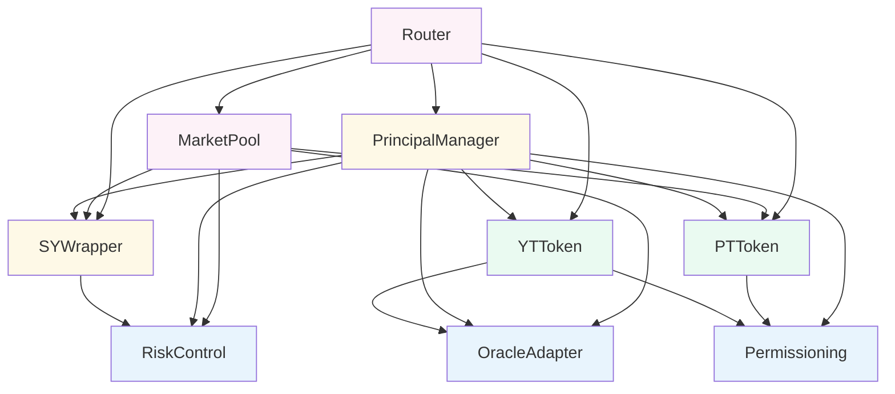
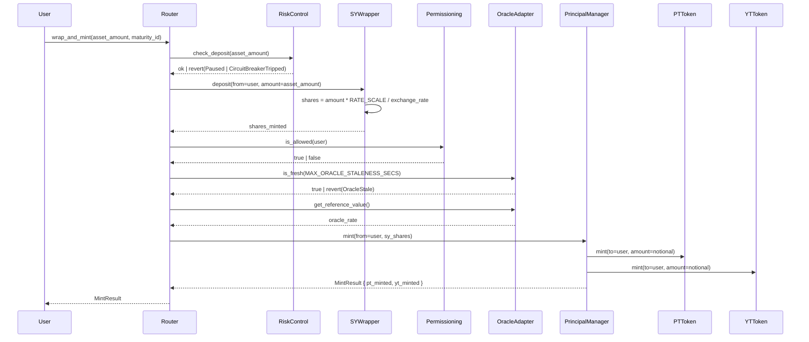
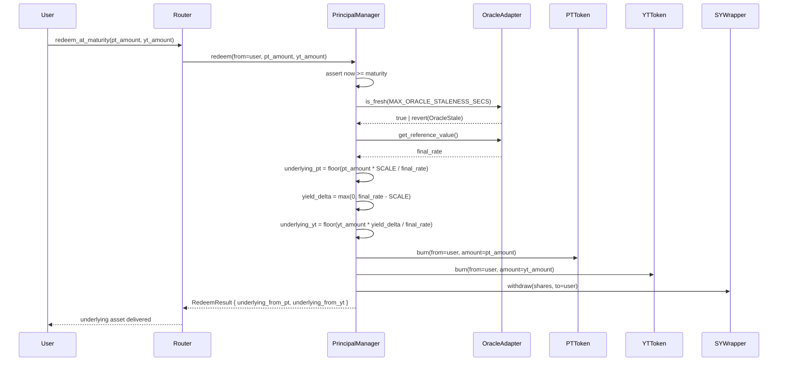
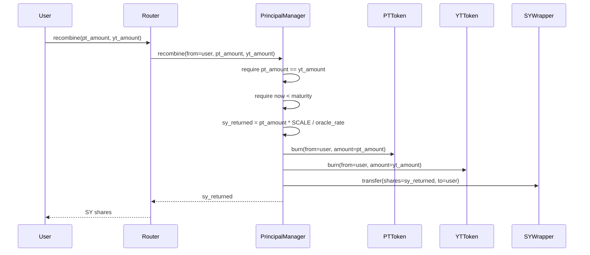

# Principal Protocol — Full-Stack Architecture

Version: 0.2 — Complete System Design  
Chain: Stellar / Soroban  
Stack: Soroban contracts · Stellar SDK · Horizon · Soroban RPC · Backend API · Frontend client

---

## 1. System Layers

Principal Protocol is composed of five layers that work together from a user action in a browser down to on-chain settlement on Stellar.

```
┌──────────────────────────────────────────────────────────────────────────┐
│  LAYER 5 — FRONTEND CLIENT                                              │
│  Any web or mobile client that supports Stellar wallet signing           │
└────────────────────────────────┬─────────────────────────────────────────┘
                                 │ HTTPS / WebSocket
┌────────────────────────────────▼─────────────────────────────────────────┐
│  LAYER 4 — BACKEND API                                                  │
│  Transaction building · Oracle relay · Event indexer · Market data cache │
└────────────────────────────────┬─────────────────────────────────────────┘
                                 │ Soroban RPC  /  Horizon REST
┌────────────────────────────────▼─────────────────────────────────────────┐
│  LAYER 3 — STELLAR NETWORK INTERFACE                                    │
│  Horizon API · Soroban RPC · Event streaming · Transaction submission    │
└────────────────────────────────┬─────────────────────────────────────────┘
                                 │
┌────────────────────────────────▼─────────────────────────────────────────┐
│  LAYER 2 — SOROBAN SMART CONTRACTS                                      │
│  Router · MarketPool · PrincipalManager · SYWrapper · PTToken · YTToken  │
│  OracleAdapter · Permissioning · RiskControl                             │
└────────────────────────────────┬─────────────────────────────────────────┘
                                 │
┌────────────────────────────────▼─────────────────────────────────────────┐
│  LAYER 1 — STELLAR LEDGER                                               │
│  Consensus · Stellar Asset Contracts · Account ledger entries            │
└──────────────────────────────────────────────────────────────────────────┘
```

The protocol is **asset-agnostic**. Any Stellar yield-bearing asset represented as a SEP-41 / Stellar Asset Contract can be wrapped and tokenized. USDY (Ondo) is the first supported market and is used throughout this document as a reference example.

---

## 2. Smart Contract Layer

### 2.1 Contract inventory

| Contract | Phase | Role |
|---|---|---|
| `OracleAdapter` | 1 — POC | Reference value feed for any underlying asset, with freshness controls |
| `Permissioning` | 1 — POC | Account and asset eligibility registry (optional, per-asset) |
| `RiskControl` | 1 — POC | Global pause, multi-pauser roles, rolling circuit breaker |
| `SYWrapper` | 1 — POC | Standardized yield wrapper; accepts any SAC-compatible yield asset |
| `PrincipalManager` | 1 — POC | Mints/burns PT and YT from SY shares; settles at maturity |
| `PTToken` | 2 — Planned | Standalone SEP-41 Principal Token per maturity |
| `YTToken` | 2 — Planned | Standalone SEP-41 Yield Token with claimable yield |
| `MarketPool` | 2 — Planned | Yield-curve AMM for PT ↔ SY trading |
| `Router` | 2 — Planned | Single-transaction orchestration for all user flows |

### 2.2 Contract dependency graph



### 2.3 Asset-agnostic design

Each set of per-maturity contracts (`PrincipalManager`, `PTToken`, `YTToken`, `MarketPool`) is instantiated independently for each combination of underlying asset and maturity date. Infrastructure contracts (`OracleAdapter`, `Permissioning`, `RiskControl`, `SYWrapper`) are shared across all markets for a given underlying. The `Router` is a single shared contract that maintains a registry mapping each `maturity_id` (the `PrincipalManager` address) to its full associated contract set.

```
        Shared infrastructure (one set per underlying asset)
        ┌──────────────────────────────────────────────┐
        │  OracleAdapter (asset reference value)        │
        │  Permissioning (eligibility — optional)       │
        │  RiskControl   (pause + circuit breaker)      │
        │  SYWrapper     (yield wrapper for this asset) │
        └──────────────────────────────────────────────┘
                              │
          ┌───────────────────┼───────────────────┐
          ▼                   ▼                   ▼
    Maturity: 3M        Maturity: 6M        Maturity: 12M
    PrincipalManager    PrincipalManager    PrincipalManager
    PTToken  ─set_minter▶ PM   PTToken         PTToken
    YTToken  ─set_minter▶ PM   YTToken         YTToken
    MarketPool          MarketPool          MarketPool

    Router (shared — registered for all maturities via register_market)
```

**Two-phase token initialization:** `PTToken` and `YTToken` are deployed before `PrincipalManager` (so their addresses can be passed to it at init), then `set_minter(principal_manager_address)` is called on each after `PrincipalManager` is deployed. This breaks the circular dependency. Until `set_minter` is called, `mint` and `burn` revert with `Unauthorized`.

A new asset is onboarded by deploying a fresh infrastructure set and per-maturity contracts, then registering them in the Router. No changes to existing deployed contracts are required.

### 2.4 Core on-chain sequences

#### Deposit and mint



#### AMM swap: SY → PT

```mermaid
sequenceDiagram
    participant U as User
    participant RT as Router
    participant MP as MarketPool
    participant OA as OracleAdapter
    participant SYW as SYWrapper
    participant PT as PTToken

    U->>RT: swap_sy_for_pt(sy_in, min_pt_out)
    RT->>MP: swap_sy_for_pt(sy_in, min_pt_out)
    MP->>OA: get_reference_value()
    OA-->>MP: exchange_rate
    MP->>MP: compute proportion = v_pt / (v_pt + v_sy)
    MP->>MP: logit = ln(proportion / (1 - proportion))
    MP->>MP: scalar = scalar_root * sqrt(τ)
    MP->>MP: r_implied = logit / scalar + anchor_rate
    MP->>MP: solve Δpt preserving r_implied; apply fee
    MP->>SYW: transfer(from=user, to=pool, amount=sy_in)
    MP->>PT: transfer(from=pool, to=user, amount=pt_out)
    MP-->>RT: pt_out
    RT->>RT: require pt_out >= min_pt_out | revert(SlippageExceeded)
    RT-->>U: pt_out
```

#### Flash-mint YT (buy YT in one transaction)

```mermaid
sequenceDiagram
    participant U as User
    participant RT as Router
    participant PM as PrincipalManager
    participant MP as MarketPool
    participant PT as PTToken
    participant YT as YTToken

    U->>RT: swap_sy_for_yt(sy_in, min_yt_out)
    RT->>PM: mint(sy_shares=sy_in) → pt_minted, yt_minted
    PM->>PT: mint(to=Router, amount=pt_minted)
    PM->>YT: mint(to=Router, amount=yt_minted)
    RT->>MP: swap_pt_for_sy(pt_in=pt_minted) → sy_back
    MP->>PT: transfer(from=Router, to=pool, amount=pt_minted)
    Note over RT: Net cost = sy_in - sy_back; net gain = yt_minted
    RT->>RT: require yt_minted >= min_yt_out
    RT->>YT: transfer(from=Router, to=user, amount=yt_minted)
    RT-->>U: yt_minted
```

#### Maturity redemption



#### Pre-maturity recombination



---

## 3. Stellar Network Interface Layer

### 3.1 Components

| Stellar component | Role |
|---|---|
| **Soroban RPC** | Simulate and submit contract invocations; read contract storage; fetch events |
| **Horizon API** | Query account balances (underlying asset SAC trust lines), fee stats, tx history |
| **Stellar Event Stream** | Poll contract events for the indexer |
| **Stellar SDK (JS/TS)** | Build XDR transactions on the backend; parse results on backend and frontend |
| **Stellar CLI** | Admin operations: deploy contracts, initialize, update parameters |
| **Freighter / SEP-7 wallets** | Browser wallet signing — Freighter, xBull, Lobstr, or any SEP-7-compatible wallet |

### 3.2 Transaction lifecycle

Every user-facing operation follows this exact lifecycle:

```
User action (frontend)
    │
    ▼
Backend API
  1. Receive intent: { account, action, params }
  2. Fetch fee stats          → GET Horizon /fee_stats
  3. Simulate transaction     → POST Soroban RPC simulateTransaction
     (get resource footprint, auth entries, fee estimate)
  4. Assemble XDR envelope
     (InvokeHostFunction + footprint + resource fee)
  5. Return unsigned XDR to frontend
    │
    ▼
Frontend (wallet)
  6. Present operation summary to user
  7. User approves → wallet signs XDR
     (Freighter: signTransaction(xdr, { network }))
  8. Return signed XDR to backend
    │
    ▼
Backend API
  9. Submit signed transaction → POST Soroban RPC sendTransaction
 10. Poll for confirmation     → GET Soroban RPC getTransaction(hash)
 11. Parse result XDR; extract return values
 12. Return { status, result } to frontend
```

No private keys are ever held by the backend for user operations. The backend only builds and submits; signing always happens in the user's wallet.

### 3.3 Soroban RPC methods

| Method | Used for |
|---|---|
| `simulateTransaction` | Validate operation, compute footprint and resource limits, get auth entries |
| `sendTransaction` | Submit a signed transaction |
| `getTransaction` | Poll until `SUCCESS` or `FAILED`; extract return value XDR |
| `getLedgerEntries` | Read specific contract storage keys directly (oracle rate, pool reserves, balances) |
| `getEvents` | Fetch contract events for a ledger range (indexer) |
| `getLatestLedger` | Get current ledger sequence and close time |

### 3.4 Horizon endpoints

| Endpoint | Used for |
|---|---|
| `GET /accounts/{address}` | User's underlying asset balance (SAC trust line) and XLM |
| `GET /transactions` | Transaction history for a given account |
| `GET /fee_stats` | Current base fee and surge pricing |
| `GET /ledgers/latest` | Current ledger close timestamp |

### 3.5 Contract event subscription

The backend polls `getEvents` at every new ledger (~5s) and dispatches by event type:

| Contract | Event symbol | Backend action |
|---|---|---|
| OracleAdapter | `ref_set` | Update cached rate; recompute implied APY; push WebSocket update |
| SYWrapper | `deposit` | Update TVL; push market update |
| SYWrapper | `withdraw` | Update TVL |
| PrincipalManager | `mint` | Update outstanding PT/YT supply |
| PrincipalManager | `redeem` | Update settlement log; reduce supply |
| PrincipalManager | `recombine` | Update supply |
| MarketPool | `swap` | Update pool reserves; recompute implied rate; append rate history |
| MarketPool | `add_liq` | Update pool depth |
| MarketPool | `rem_liq` | Update pool depth |
| RiskControl | `paused` | Broadcast protocol-paused event to all WebSocket clients |
| RiskControl | `cb_tripped` | Broadcast circuit-breaker warning; disable deposit endpoints |

---

## 4. Backend API Layer

### 4.1 Overview

The backend is an API service that handles all interactions with the Stellar network on behalf of the frontend. It holds no user funds and no user private keys. It comprises two distinct parts: a **stateless REST/WebSocket server** (transaction building, market data) and a **stateful oracle relay** (a scheduled job that holds and uses an admin signing key for oracle updates only). Its responsibilities are:

- **Transaction building** — construct unsigned Soroban XDR so the frontend only needs to sign.
- **State caching** — cache contract state (oracle rate, pool reserves) to reduce direct RPC calls.
- **Event indexing** — persist on-chain events into a queryable database.
- **Market data** — compute and serve implied APY, pool depth, and rate history.
- **Oracle relay** — submit signed oracle updates on a schedule (admin-only operation).
- **Eligibility relay** — fetch permissioning state for connected accounts.

The API is designed to be **asset-agnostic**. Market routes accept a `market_id` parameter that identifies the target underlying asset and maturity. The same endpoints serve USDY, BENJI, USTBL, or any other asset that has been registered in the protocol.

### 4.2 Service architecture

```
┌────────────────────────────────────────────────────────────────────┐
│  Backend API                                                       │
│                                                                    │
│  ┌─────────────────┐  ┌──────────────────┐  ┌──────────────────┐ │
│  │  REST API        │  │  WebSocket server │  │  Oracle relay    │ │
│  │  /api/v1/*       │  │  /ws              │  │  (cron job)      │ │
│  └────────┬────────┘  └────────┬─────────┘  └────────┬─────────┘ │
│           │                    │                      │            │
│  ┌────────▼────────────────────▼──────────────────────▼─────────┐ │
│  │                       Service Layer                           │ │
│  │  MarketService · OracleService · PortfolioService             │ │
│  │  TransactionBuilder · Indexer · PermissioningService          │ │
│  └────────┬──────────────────────────────────────────────────────┘ │
│           │                                                         │
│  ┌────────▼──────────────────────────────────────────────────────┐ │
│  │                       Data Layer                               │ │
│  │  Cache (Redis) · Event store (PostgreSQL) · In-memory state   │ │
│  └────────┬──────────────────────────────────────────────────────┘ │
└───────────┼────────────────────────────────────────────────────────┘
            │
     Soroban RPC  /  Horizon API
```

### 4.3 REST API routes

All routes that reference a specific market accept `market_id` in the format `{asset}:{maturity}` (e.g. `usdy:3m`, `benji:6m`). The backend resolves this to the correct set of contract addresses from a registry.

#### Markets

```
GET  /api/v1/markets
     → list all active markets across all assets and maturities

GET  /api/v1/markets/:market_id
     → pool state, oracle rate, implied APY, PT price, YT yield, TVL

GET  /api/v1/markets/:market_id/rates/history?from=&to=
     → time series of implied APY (from indexed swap events)

GET  /api/v1/markets/:market_id/depth
     → simulated order book depth from AMM curve at current state
```

#### Oracle

```
GET  /api/v1/oracle/:asset/rate
     → current reference value and freshness status for a given asset

GET  /api/v1/oracle/:asset/history?from=&to=
     → historical reference values from indexed oracle events
```

#### Transaction builder

All transaction endpoints return unsigned XDR. The client signs and returns it to `/tx/submit`.

```
POST /api/v1/tx/wrap-and-mint
     { account, asset, amount, market_id }
     → unsigned XDR: deposit(SYWrapper) + mint(PrincipalManager)

POST /api/v1/tx/swap-sy-for-pt
     { account, sy_amount, min_pt_out, market_id }
     → unsigned XDR: Router.swap_sy_for_pt(...)

POST /api/v1/tx/swap-pt-for-sy
     { account, pt_amount, min_sy_out, market_id }

POST /api/v1/tx/swap-sy-for-yt
     { account, sy_amount, min_yt_out, market_id }
     → unsigned XDR: Router flash-mint pattern

POST /api/v1/tx/swap-yt-for-sy
     { account, yt_amount, min_sy_out, market_id }
     → unsigned XDR: Router flash-redeem pattern

POST /api/v1/tx/add-liquidity
     { account, pt_amount, sy_amount, min_lp_out, market_id }

POST /api/v1/tx/remove-liquidity
     { account, lp_amount, market_id }

POST /api/v1/tx/redeem
     { account, pt_amount, yt_amount, market_id }

POST /api/v1/tx/recombine
     { account, pt_amount, yt_amount, market_id }

POST /api/v1/tx/submit
     { signed_xdr }
     → { tx_hash, status }

GET  /api/v1/tx/:hash/status
     → { status: "pending"|"success"|"failed", result?, error? }
```

#### Portfolio

```
GET  /api/v1/portfolio/:account
     → balances across all assets and maturities:
        { asset_balances[], sy_balances[], pt_holdings[], yt_holdings[], lp_holdings[] }

GET  /api/v1/portfolio/:account/eligibility
     → { assets: [{ asset_id, is_allowed }] }

GET  /api/v1/portfolio/:account/history
     → paginated on-chain activity for this account
```

### 4.4 WebSocket push events

The backend pushes real-time updates to subscribed frontend clients:

```json
{ "type": "rate_update",    "asset": "usdy",
  "data": { "oracle_rate": 10312000, "implied_apy_bps": 421, "timestamp": 1748000000 } }

{ "type": "pool_update",    "market_id": "usdy:3m",
  "data": { "total_pt": "...", "total_sy": "...", "implied_rate": "..." } }

{ "type": "protocol_paused",
  "data": { "asset": "usdy", "caller": "G..." } }

{ "type": "circuit_breaker",
  "data": { "asset": "usdy", "volume": "...", "limit": "...", "window_reset_at": "..." } }

{ "type": "tx_confirmed",
  "data": { "hash": "...", "account": "G...", "action": "mint", "result": { ... } } }
```

Clients subscribe by account and/or market_id. The backend manages subscriptions and fans out relevant events.

### 4.5 Oracle relay service

The oracle relay is a scheduled backend job that bridges an off-chain reference value feed to the `OracleAdapter` contract. It is **asset-specific**: each supported underlying asset has its own relay configuration pointing to its data source (e.g. an issuer API, a price aggregator, or an institutional feed).

```
Oracle relay loop (configurable interval, e.g. every 10 minutes):
  1. Fetch reference value from configured feed URL for this asset
  2. Validate: timestamp is newer than last on-chain timestamp
  3. Validate: rate deviation from on-chain rate ≤ MAX_DEVIATION_BPS
  4. Build OracleAdapter.set_reference_value transaction (XDR)
  5. Sign with oracle admin key (HSM or secrets manager — never in application memory)
  6. Submit via Soroban RPC sendTransaction
  7. Confirm via getTransaction polling
  8. Log result; trigger alert on failure
```

The relay is intentionally simple: it fetches a single trusted feed and relays it. It does not aggregate. **Phase 2 note:** Multi-source aggregation (on-chain median across multiple independent relayers) requires an upgraded `OracleAdapter` with a `submit_value(caller, value, timestamp)` interface and a `aggregate()` function that computes the median and writes it as the canonical price. The Phase 1 `OracleAdapter` interface (`set_reference_value`) is single-submitter only and would need to be redeployed for multi-source support. The relay max_stale_seconds configuration should match `MAX_ORACLE_STALENESS_SECS` defined in `PrincipalManager` to prevent the on-chain freshness check from failing.

**Configuration per asset:**

```yaml
assets:
  - id: usdy
    oracle_contract: C...
    feed_url: https://...          # issuer or institutional feed
    admin_key_ref: hsm://...       # key reference, never plaintext
    relay_interval_secs: 600
    max_deviation_bps: 100         # 1% max per update
    max_staleness_secs: 3600

  - id: benji
    oracle_contract: C...
    feed_url: https://...
    admin_key_ref: hsm://...
    relay_interval_secs: 600
    max_deviation_bps: 100
    max_staleness_secs: 3600
```

### 4.6 Indexer service

The indexer polls `getEvents` from Soroban RPC at each new ledger and writes structured records to PostgreSQL for queryable history and analytics.

```
Indexer loop (~every 5s):
  1. getLatestLedger → current_ledger
  2. getEvents(from=last_indexed_ledger, to=current_ledger,
               contract_ids=[all protocol contracts])
  3. For each event:
     - parse topic + data XDR via Stellar SDK
     - insert into events table
     - update materialized views (TVL, daily volume, implied APY series)
  4. Update last_indexed_ledger checkpoint
```

**PostgreSQL schema (core tables):**

```sql
CREATE TABLE events (
  id            BIGSERIAL PRIMARY KEY,
  ledger        INTEGER NOT NULL,
  tx_hash       TEXT NOT NULL,
  contract_id   TEXT NOT NULL,
  event_type    TEXT NOT NULL,
  asset_id      TEXT,
  market_id     TEXT,
  account       TEXT,
  amount_in     NUMERIC,
  amount_out    NUMERIC,
  oracle_rate   NUMERIC,
  implied_rate  NUMERIC,
  timestamp     TIMESTAMPTZ NOT NULL,
  raw_data      JSONB
);

CREATE TABLE market_snapshots (
  id            BIGSERIAL PRIMARY KEY,
  market_id     TEXT NOT NULL,
  ledger        INTEGER NOT NULL,
  total_pt      NUMERIC,
  total_sy      NUMERIC,
  implied_rate  NUMERIC,
  tvl_underlying NUMERIC,
  timestamp     TIMESTAMPTZ NOT NULL
);

CREATE TABLE oracle_history (
  id            BIGSERIAL PRIMARY KEY,
  asset_id      TEXT NOT NULL,
  reference_value NUMERIC NOT NULL,
  ledger        INTEGER NOT NULL,
  timestamp     TIMESTAMPTZ NOT NULL
);
```

---

## 5. Frontend Integration Layer

### 5.1 Responsibilities

The frontend is a web client that:

- Connects to a Stellar-compatible browser wallet.
- Requests unsigned transaction XDR from the backend.
- Presents the operation summary to the user and triggers wallet signing.
- Submits the signed XDR back to the backend and polls for confirmation.
- Displays market data, user portfolio, and protocol state received from the backend API and WebSocket.

The frontend is **not tied to any specific asset or market**. All asset references, contract addresses, and market parameters are provided by the backend API. Adding a new underlying asset requires no frontend code changes — the backend registry drives what markets are displayed.

### 5.2 Recommended tech stack

| Concern | Recommended choice |
|---|---|
| Framework | Next.js (App Router) or any React-based framework |
| Language | TypeScript |
| Stellar SDK | `@stellar/stellar-sdk` |
| Wallet integration | `@stellar/freighter-api` (primary); SEP-7 for deep-link wallets |
| State management | Any (Zustand, Redux, React Query) |
| Real-time data | Native WebSocket client |

### 5.3 Wallet integration

The frontend integrates with Freighter and any SEP-7-compatible Stellar wallet. The integration pattern is the same regardless of underlying asset.

```typescript
import { getPublicKey, signTransaction, isConnected } from '@stellar/freighter-api';

// Connect wallet
const connected  = await isConnected();
const publicKey  = await getPublicKey();   // G... Stellar address

// Build transaction via backend
const { xdr } = await api.post('/tx/wrap-and-mint', {
  account:   publicKey,
  asset:     'usdy',               // or any supported asset
  amount:    '100_0000000',        // in stroops / token decimals
  market_id: 'usdy:3m',
});

// Sign in wallet
const { signedXDR } = await signTransaction(xdr, {
  network: 'PUBLIC',               // Freighter network name for Stellar mainnet. Use 'TESTNET' for testnet.
  accountToSign: publicKey,
});

// Submit via backend
const { tx_hash } = await api.post('/tx/submit', { signed_xdr: signedXDR });
```

**Auth entry handling:** Soroban contract calls that require `require_auth()` produce auth entries during the simulation step. These are embedded into the XDR envelope by the backend before returning it to the frontend. Freighter displays a human-readable summary of the contract call (contract ID, function name, arguments) before the user approves.

### 5.4 Transaction state machine

```
idle
 │ user triggers action
 ▼
building          POST /api/v1/tx/:action → unsigned XDR
 │
 ▼
awaiting_signature   wallet.signTransaction(xdr)
 │
 ▼
submitting        POST /api/v1/tx/submit → tx_hash
 │
 ▼
confirming        GET /api/v1/tx/:hash/status  (poll or WebSocket)
 │
 ├─ success ──►   confirmed   display result; refresh portfolio balances
 └─ failed  ──►   error       display error message; allow retry
```

### 5.5 Eligibility handling

For permissioned assets, the frontend fetches eligibility before presenting protocol actions:

```typescript
const { assets } = await api.get(`/portfolio/${publicKey}/eligibility`);
const eligible = assets.find(a => a.asset_id === 'usdy')?.is_allowed;

if (!eligible) {
  // show compliance gate specific to the asset's onboarding flow
  // e.g. redirect to the underlying asset issuer's KYC portal
}
```

Eligibility state is polled after each block while the user is on a permissioned market page. When eligibility is granted on-chain, the gate lifts automatically.

---

## 6. Stellar SDK Integration Reference

### 6.1 Building a Soroban contract call (Node.js / TypeScript)

```typescript
import {
  Contract, SorobanRpc, TransactionBuilder,
  Networks, BASE_FEE, nativeToScVal, Address,
} from '@stellar/stellar-sdk';

const rpc     = new SorobanRpc.Server(SOROBAN_RPC_URL);
const contract = new Contract(ROUTER_CONTRACT_ID);

// Build operation
const op = contract.call(
  'swap_sy_for_pt',
  Address.fromString(userAddress).toScVal(),
  nativeToScVal(syAmount,  { type: 'i128' }),
  nativeToScVal(minPtOut,  { type: 'i128' }),
);

// Load account sequence number
const account = await rpc.getAccount(userAddress);

// Assemble transaction
const tx = new TransactionBuilder(account, {
  fee: BASE_FEE,
  networkPassphrase: Networks.PUBLIC,    // Stellar mainnet. Use Networks.TESTNET for testnet.
})
  .addOperation(op)
  .setTimeout(30)
  .build();

// Simulate: get footprint, auth entries, resource fee
const sim = await rpc.simulateTransaction(tx);
if (SorobanRpc.Api.isSimulationError(sim)) throw new Error(sim.error);

// Assemble with footprint and resource fee
const assembled = SorobanRpc.assembleTransaction(tx, sim).build();

// Return XDR to frontend for wallet signing
return assembled.toXDR();
```

### 6.2 Reading contract state directly (getLedgerEntries)

```typescript
import { xdr, Address, Contract } from '@stellar/stellar-sdk';

// Build a storage key for a specific contract data entry
const contractDataKey = xdr.LedgerKey.contractData(
  new xdr.LedgerKeyContractData({
    contract:    new Address(ORACLE_ADAPTER_CONTRACT_ID).toScAddress(),
    key:         xdr.ScVal.scvLedgerKeyContractInstance(),
    durability:  xdr.ContractDataDurability.persistent(),
  })
);

const { entries } = await rpc.getLedgerEntries(contractDataKey);
// entries[0].val contains the contract instance storage as XDR
// parse with xdr.ScVal.fromXDR(...) to extract Price, Timestamp, etc.
```

### 6.3 Polling contract events (indexer)

```typescript
const events = await rpc.getEvents({
  startLedger: lastProcessedLedger,
  filters: [
    {
      type: 'contract',
      contractIds: ALL_PROTOCOL_CONTRACT_IDS,   // all assets, all maturities
    },
  ],
  limit: 200,
});

for (const event of events.events) {
  const topicVals = event.topic.map(t => scValToNative(xdr.ScVal.fromXDR(t, 'base64')));
  const eventType = topicVals[0];               // e.g. 'mint', 'swap', 'ref_set'
  const data      = scValToNative(xdr.ScVal.fromXDR(event.value.xdr, 'base64'));
  // dispatch to indexer handler by eventType
}
```

### 6.4 Fetching underlying asset balances (Horizon)

```typescript
import { Horizon } from '@stellar/stellar-sdk';

const horizon = new Horizon.Server(HORIZON_URL);
const account = await horizon.loadAccount(userAddress);

// The underlying asset is a Stellar Asset Contract (SAC)
// Its balance appears as a trust line on the account
const assetBalance = account.balances.find(
  b => b.asset_type !== 'native'
    && b.asset_code   === ASSET_CODE          // e.g. 'USDY'
    && b.asset_issuer === ASSET_ISSUER        // issuer's G... address
);
```

---

## 7. Oracle Architecture

### 7.1 Full data flow

```
External reference value feed (issuer API or price aggregator)
        │
        ▼  (HTTPS, configurable interval)
Oracle Relay (backend scheduled job — one per asset)
  - validate rate delta vs on-chain value
  - sign transaction (HSM / secrets manager)
        │
        ▼  (Soroban RPC sendTransaction)
OracleAdapter contract (on-chain)
  - stores: Price, Timestamp
  - emits:  ref_set event
        │
        ├──▶ Backend indexer → oracle_history table → /oracle/:asset/history
        │
        ├──▶ WebSocket push → rate_update to subscribed clients
        │
        └──▶ PrincipalManager / MarketPool
             (read at mint / swap / redeem via get_reference_value)
```

### 7.2 Phase 1 vs Phase 2 oracle properties

| Property | Phase 1 — POC | Phase 2 — Production |
|---|---|---|
| Source | Single trusted relay per asset | Multiple independent relayers per asset |
| Aggregation | None (single submitter) | On-chain median across relayer submissions |
| Staleness threshold | 3600s (1 hour) | 600s (10 minutes) |
| Failure response | Manual admin pause | Automatic pause via RiskControl |
| Key management | Keypair in secrets manager | HSM or threshold multisig |
| New asset onboarding | Deploy new OracleAdapter + configure relay | Same, no code changes to existing contracts |

---

## 8. Security Architecture

### 8.1 On-chain security

| Mechanism | Description |
|---|---|
| `require_auth()` on all mutations | Every state-changing call requires Soroban-native authorization |
| Monotonic oracle timestamps | New values rejected if `timestamp ≤ stored_timestamp` |
| Oracle freshness at mint/redeem | `is_fresh()` called before any operation that prices against the oracle |
| Eligibility checks | `Permissioning.is_allowed()` at every mint, transfer, and redemption for permissioned assets |
| Global pause | `RiskControl.pause()` halts all minting, trading, and redemption |
| Rolling circuit breaker | Caps deposit volume per 24-hour window; resets automatically |
| Slippage protection | `min_out` on every Router swap; reverts with `SlippageExceeded` |
| YT yield floor | `max(0, rate_delta)` — YT yields zero if no growth; PT principal never at risk |
| Overflow protection | `overflow-checks = true` in Rust release profile; checked arithmetic throughout |
| Checks-effects-interactions | State updated before cross-contract calls on all contracts |

### 8.2 Backend security

| Mechanism | Description |
|---|---|
| No user key handling | Backend never receives or stores user private keys |
| Simulation before submission | Every transaction simulated first; rejects invalid operations before user is asked to sign |
| Oracle rate sanity check | Relay rejects updates with deviation above `MAX_DEVIATION_BPS` vs last on-chain value |
| HSM for oracle signing | Oracle admin key never in application memory |
| Input validation | All amounts, addresses, and market IDs validated and sanitized before XDR construction |
| Rate limiting | Transaction builder endpoints rate-limited per IP and per account |
| Read-only network access | Backend holds no funds; all on-chain state is read-only via RPC |

### 8.3 Frontend / wallet security

| Mechanism | Description |
|---|---|
| Unsigned XDR from backend | Frontend only handles unsigned XDR; no key material ever touches the frontend |
| Wallet approval | Freighter shows the user the contract call details before signing |
| Slippage confirmation | User is shown expected vs minimum output before approving |
| Eligibility gate | UI blocks protocol actions for ineligible accounts before they attempt a transaction |

---

## 9. Deployment Architecture

### 9.1 Contract deployment order

`PTToken` and `YTToken` have a circular address dependency with `PrincipalManager` (each needs the other's address). This is resolved with two-phase initialization as documented in TECHNICAL_SPECIFICATION.md §17.1.

```
Phase A — Infrastructure (once per underlying asset)
  Step 1  OracleAdapter       no dependencies
  Step 2  Permissioning       no dependencies
  Step 3  RiskControl         no dependencies
  Step 4  SYWrapper           needs: underlying asset SAC address

Phase B — Per-maturity contracts (repeat per expiry date)
  Step 5  PTToken             initialize without minter (two-phase init)
  Step 6  YTToken             initialize without minter; needs: OracleAdapter
  Step 7  PrincipalManager    needs: SYWrapper, OracleAdapter, Permissioning,
                                     RiskControl, PTToken, YTToken, maturity timestamp
  Step 8  PTToken.set_minter(PrincipalManager)
          YTToken.set_minter(PrincipalManager)
  Step 9  MarketPool          needs: PTToken, SYWrapper, OracleAdapter, RiskControl

Phase C — Router (once; re-register per new maturity)
  Step 10 Router              initialize once; call register_market for each maturity
```

### 9.2 Contract build

```bash
rustup target add wasm32-unknown-unknown
cargo build --target wasm32-unknown-unknown --release
```

Artifacts in `target/wasm32-unknown-unknown/release/`.

### 9.3 Stellar CLI deploy pattern

```bash
stellar contract deploy \
  --wasm target/.../principal_oracle_adapter.wasm \
  --source admin --network testnet --alias oracle_adapter_usdy

stellar contract invoke \
  --id oracle_adapter_usdy --source admin --network testnet \
  -- initialize --admin <ADMIN_ADDRESS>
```

See [DEPLOYMENT.md](DEPLOYMENT.md) for the full guide.

### 9.4 Environment configuration

```bash
# Network
STELLAR_NETWORK=testnet
SOROBAN_RPC_URL=https://soroban-testnet.stellar.org
HORIZON_URL=https://horizon-testnet.stellar.org
NETWORK_PASSPHRASE="Test SDF Network ; September 2015"

# Contract registry (JSON or DB — one entry per asset+maturity)
CONTRACT_REGISTRY_PATH=./config/contracts.json

# Oracle relay (per asset in YAML config)
ORACLE_CONFIG_PATH=./config/oracles.yaml

# Database
DATABASE_URL=postgres://...
REDIS_URL=redis://...
```

**`contracts.json` structure:**

```json
{
  "usdy": {
    "oracle_adapter":    "C...",
    "permissioning":     "C...",
    "risk_control":      "C...",
    "sy_wrapper":        "C...",
    "markets": {
      "usdy:3m":  { "principal_manager": "C...", "pt_token": "C...", "yt_token": "C...", "market_pool": "C...", "expiry": 1758000000 },
      "usdy:6m":  { "principal_manager": "C...", "pt_token": "C...", "yt_token": "C...", "market_pool": "C...", "expiry": 1765000000 },
      "usdy:12m": { "principal_manager": "C...", "pt_token": "C...", "yt_token": "C...", "market_pool": "C...", "expiry": 1779000000 }
    }
  },
  "benji": {
    "oracle_adapter":    "C...",
    "permissioning":     "C...",
    "risk_control":      "C...",
    "sy_wrapper":        "C...",
    "markets": { ... }
  }
}
```

---

## 10. Storage Tier Design

| Tier | TTL behaviour | Used for |
|---|---|---|
| `instance()` | Extended automatically when any entry in the contract instance is accessed | Admin, oracle value, pool reserves, config, global flags, totals |
| `persistent()` | Does **not** auto-extend — contracts must call `extend_ttl` explicitly; default ~30 days | Per-user: SY balances, PT/YT balances, LP balances, yield indices, eligibility flags |
| `temporary()` | Short-lived; expires and is deleted automatically | Not used |

Persistent entries must be explicitly extended on every active read or write to ensure active-user state never expires:
```rust
env.storage().persistent().extend_ttl(&key, ELIGIBILITY_TTL_LEDGERS, ELIGIBILITY_TTL_LEDGERS);
```
`ELIGIBILITY_TTL_LEDGERS = 518_400` ≈ 30 days at 5 s/ledger. If a user's entry expires before they interact again, they receive `NotInitialized` and must re-establish their position.

---

## 11. Contract Event Reference

| Contract | Symbol | Payload |
|---|---|---|
| OracleAdapter | `ref_set` | `(value: i128, timestamp: u64)` |
| Permissioning | `acct_grant` | `(account: Address)` |
| Permissioning | `acct_revoke` | `(account: Address)` |
| SYWrapper | `deposit` | `(from, amount, shares_minted, exchange_rate)` |
| SYWrapper | `withdraw` | `(from, shares, underlying_returned)` |
| PrincipalManager | `mint` | `(from, sy_shares, pt_minted, yt_minted, oracle_rate)` |
| PrincipalManager | `redeem` | `(from, pt, yt, underlying_pt, underlying_yt, final_rate)` |
| PrincipalManager | `recombine` | `(from, pt_amount, sy_returned)` |
| MarketPool | `swap` | `(from, token_in, amount_in, token_out, amount_out, fee, r_implied)` |
| MarketPool | `add_liq` | `(from, pt_in, sy_in, lp_minted)` |
| MarketPool | `rem_liq` | `(from, lp_burned, pt_out, sy_out)` |
| RiskControl | `paused` | `(caller: Address)` |
| RiskControl | `unpaused` | `(caller: Address)` |
| RiskControl | `cb_tripped` | `(amount, volume, limit)` |
